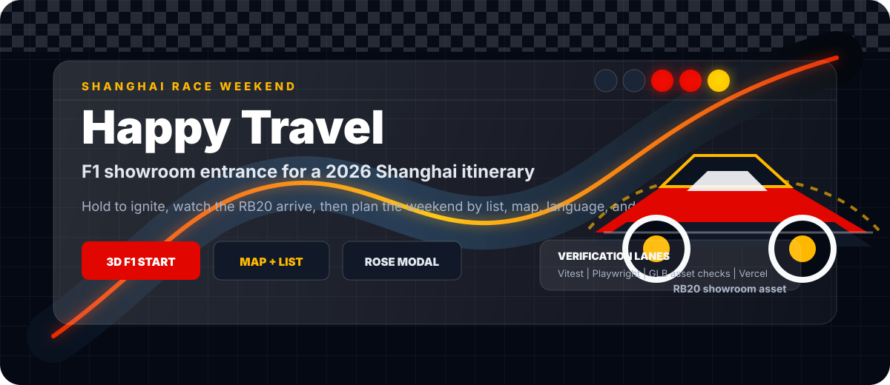

<p align="center">
  
</p>

<p align="center">
  <a href="https://f12026shanghai.vercel.app/">Live demo</a>
  |
  <a href="#quick-start">Quick start</a>
  |
  <a href="#verification">Verification</a>
</p>

# Happy Travel

Happy Travel is a React + Three.js trip planner for the 2026 Shanghai race weekend. It opens like a racing showroom: the visitor holds the start control, watches a versioned RB20 GLB load and arrive, then lands in a map/list itinerary built for the actual weekend.

## What It Does

| Layer | Experience |
| --- | --- |
| F1 welcome scene | Versioned RB20 showroom asset, ignition progress, start lights, engine audio, car interaction, explode/reassemble handoff, and post-hologram glitch timing. |
| Trip planner | Three-day itinerary, day switching, list and map modes, location highlighting, category icons, countdown, and bilingual UI toggle. |
| Hidden moments | Rose modal triggered by secret taps or device shake, plus sound and animation hooks. |
| Shipping checks | GLB validation, F1 motion checks, showroom acceptance evidence, unit tests, Playwright, and Vercel deployment flow. |

## Preview

<p>
  
</p>

<p>
  
</p>

<p>
  
</p>

<p>
  
</p>

## Tech Stack

| Area | Tools |
| --- | --- |
| App | React 19, Vite 6, TypeScript, Tailwind CSS 4 |
| Motion and 3D | Three.js, Motion, GLB assets, HDR environments, audio effects |
| Maps and data | AMap loader, local itinerary JSON, bilingual localization |
| Quality gates | Vitest, Playwright 1.61.1, GLTF validators, custom showroom/F1 scripts |

## Quick Start

```bash
pnpm install
pnpm dev
```

The local app runs through Vite on port `3000` by default.

```bash
pnpm build
pnpm preview
```

## Verification

Use the grouped gates instead of running every individual validator by hand.

| Command | Purpose |
| --- | --- |
| `pnpm test:fast` | Main local gate: TypeScript, unit tests, Playwright project resolver, asset validators, production build. |
| `pnpm test:assets` | Specialized GLB, rose, F1, audio, route, renderer, and showroom asset validation. |
| `pnpm test:impact` | Runs the Playwright browser suites affected by changed files. |
| `pnpm test:e2e` | Full Playwright end-to-end matrix. |
| `pnpm check:showroom-acceptance` | Generates local browser evidence under ignored `output/playwright/`. |
| `pnpm test:memory` | WebGL lifecycle and memory audit checks. |

CI runs `pnpm test:fast` on pull requests and `main` pushes. Browser acceptance uses the official Playwright Docker image `mcr.microsoft.com/playwright:v1.61.1-jammy`, and Vercel Git Integration publishes preview and production deployments after GitHub checks.

## Project Map

| Path | Role |
| --- | --- |
| `src/components/WelcomePage.tsx` | F1 ignition screen, loading overlay, start lights, handoff, and showroom setup. |
| `src/components/ParticleBackground.tsx` | Foreground Three.js car canvas and pointer forwarding path. |
| `src/lib/f1-*.ts` | F1 motion, arrival, wheel, glitch, ignition, interaction, and model contracts. |
| `src/lib/showroom-*.ts` | Showroom route, renderer, director, story, and quality checks. |
| `src/data/itinerary.json` | Weekend itinerary source data. |
| `public/models/2024_redbull_rb20_showroom_v5.glb` | Current accepted F1 showroom model. |
| `docs/showroom-browser-acceptance.md` | Browser evidence workflow. |
| `docs/testing/` | CI and Vercel testing notes. |

## F1 Asset Contract

The welcome scene depends on strict model ownership rules. Runtime wheel spin is limited to:

```text
WheelSpin_FL
WheelSpin_FR
WheelSpin_RL
WheelSpin_RR
```

Replacement car assets must use a new versioned GLB filename, keep the previous accepted model available, and pass focused asset, motion, wheel, airflow, studio, reflection, interaction, model, desktop, and mobile browser checks before the loader URL changes.

## Deployment

Production is served at:

```text
https://f12026shanghai.vercel.app/
```

Vercel preview deployments are created for pull requests and non-production branches. `main` creates the production deployment after checks pass.
